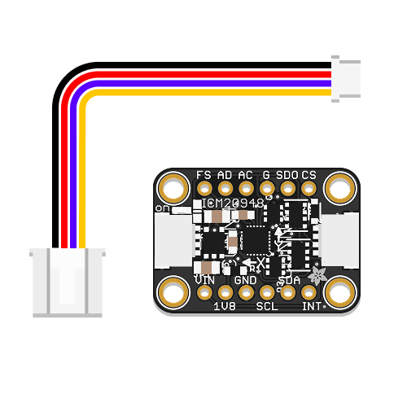

# **9DoF Motion Sensor**

<a href="../../glossary/glossary"></a> <a href="../../glossary/glossary"></a>

A motion sensor that combines **accelerometer, gyroscope, and magnetometer** in one package. It is suitable for **motion sensing**, **orientation detection**, and many more applications.

---

## **Background**

The [Adafruit ICM-20948 9-DoF IMU Sensor Board](https://learn.adafruit.com/adafruit-tdk-invensense-icm-20948-9-dof-imu) features a  **9DoF** (9-degree-of-freedom) sensor made by TDK InvenSense. This **IMU** (inertial measurement unit) integrates:

- A **3-axis accelerometer** (linear motion, in m/s²)
- A **3-axis gyroscope** (rotation, in rad/s)
- A **3-axis magnetometer** (magnetic field, in µT)

The module communicates over **I²C**. 

{: .important }
To connect the Grove IMU breakout, we use a [STEMMA QT to Grove cable](https://www.adafruit.com/product/4528). These cables can be fragile and sit tightly in their headers. Handle them with care when unseating them.

## Preparation

To use the ICM-20948 in CircuitPython, the following [libraries](../../glossary/glossary) are needed:

- `adafruit_icm20x.mpy` (driver for the ICM-20x sensor family, including ICM-20948)
- `adafruit_register` (helper library for low-level I²C register access)

{: .highlight }
Make sure both libraries are present inside the `/lib` folder on your `CIRCUITPY` drive. If not, download Adafruit’s Library Bundle for Version 9.x [here](https://circuitpython.org/libraries), extract the needed files, and copy them into `/lib`.

## Basic Usage

This example reads the acceleration, gyroscope, and magnetometer values and prints them to the serial monitor. The code assumes your module is connected to the Grove I²C header on **GP7/GP6** (SCL/SDA). Alternatively, you can use the second I²C port on GP9/GP8.

```python
# --- Imports
import time
import board
import busio
import adafruit_icm20x


# --- Variables
i2c = busio.I2C(scl=board.GP7, sda=board.GP6, frequency=400000)
icm = adafruit_icm20x.ICM20948(i2c)


# --- Functions


# --- Setup


# --- Main loop
while True:
    ax, ay, az = icm.acceleration
    gx, gy, gz = icm.gyro
    mx, my, mz = icm.magnetic

    print("Acceleration: X:{:.2f}, Y:{:.2f}, Z:{:.2f} m/s^2".format(ax, ay, az))
    print("Gyro:        X:{:.2f}, Y:{:.2f}, Z:{:.2f} rad/s".format(gx, gy, gz))
    print("Magnetometer X:{:.2f}, Y:{:.2f}, Z:{:.2f} uT".format(mx, my, mz))
    print()
    time.sleep(0.1)
```

{: .note }
If you want to see the values change visually, replace the print block with  
    ```print((ax, ay, az, gx, gy, gz, mx, my, mz))```  
Then open Mu’s **Plotter** instead of the Serial Monitor. Each axis will appear as a separate trace.


## Additional Resources

### [**Adafruit ICM-20948 Guide**](https://learn.adafruit.com/adafruit-tdk-invensense-icm-20948-9-dof-imu)

Technical details, wiring diagrams, and advanced usage notes for the sensor.
