# Components

This page provides an overview of the equipment used during our workshop.

## Core Components

|                       Microcontroller                        |                         Grove Shield                         |
| :----------------------------------------------------------: | :----------------------------------------------------------: |
|                          Pi Pico W                           |            Solderless Connector Board for Pi Pico            |
| 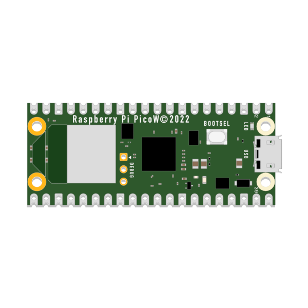 | 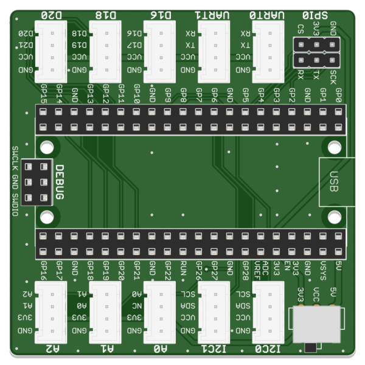 |
|  [Learn More](microcontroller/pi-pico-w){: .btn .btn-blue }  | [Learn More](grove-shield/pico-grove-shield){: .btn .btn-blue } |

## Sensors & Actuators

|                        Potentiometer                         |                        Tactile Switch                        |                         Tilt Switch                          |                          Thermistor                          |                        Photoresistor                         |
| :----------------------------------------------------------: | :----------------------------------------------------------: | :----------------------------------------------------------: | :----------------------------------------------------------: | :----------------------------------------------------------: |
|                        Position/Angle                        |                             Push                             |                             Tilt                             |                         Temperature                          |                          Brightness                          |
| 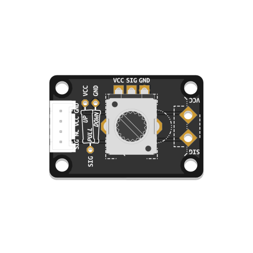 | 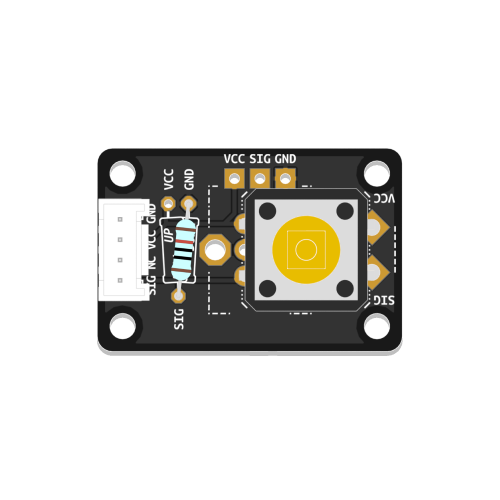 | 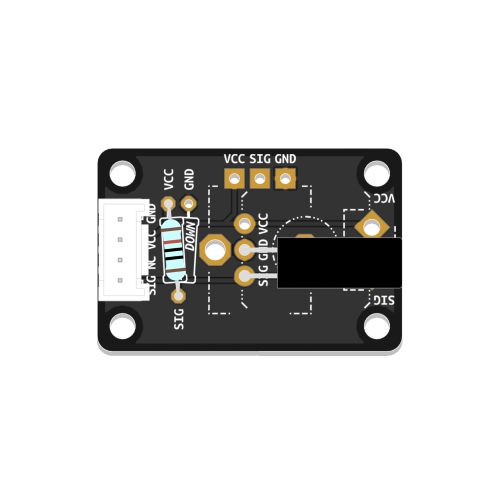 | 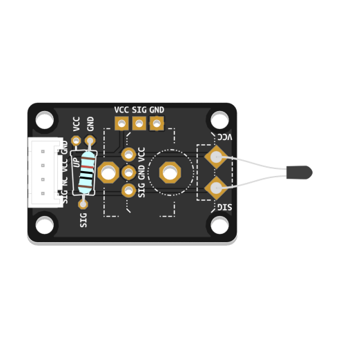 | 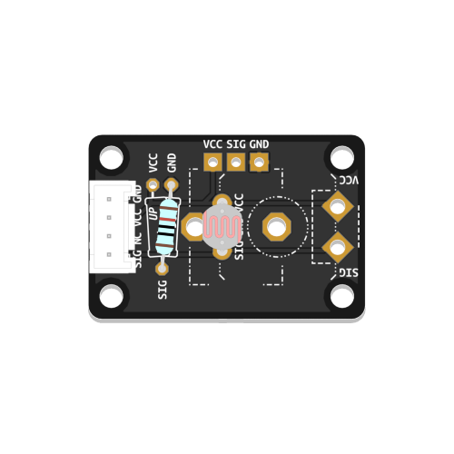 |
|   |  <a href="../glossary/glossary">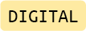</a> |   |   |   |
| [Learn More](rotary-potentiometer/rotary-potentiometer){: .btn .btn-blue } | [Learn More](tactile-switch/tactile-switch){: .btn .btn-blue } |   [Learn More](tilt-switch/tilt-switch){: .btn .btn-blue }   |    [Learn More](thermistor/thermistor){: .btn .btn-blue }    | [Learn More](photoresistor/photoresistor){: .btn .btn-blue } |

|                    Time of Flight Sensor                     |               Capacitive Touch Sensor (12 Key)               |                         Knock Sensor                         |
| :----------------------------------------------------------: | :----------------------------------------------------------: | :----------------------------------------------------------: |
|                           Distance                           |                            Touch                             |                           Impacts                            |
| 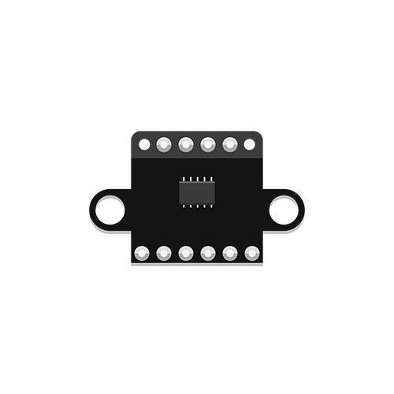 |    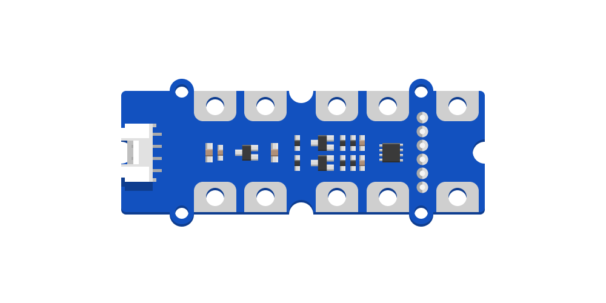     |          |
|   |   |   |
| [Learn More](time-of-flight-distance-sensor/time-of-flight-distance-sensor){: .btn .btn-blue } |   [Learn More](12key-touch/12key-touch){: .btn .btn-blue }   |  [Learn More](knock-sensor/knock-sensor){: .btn .btn-blue }  |

|                          PIR Sensor                          |                         **9DoF IMU**                         |                 Mono Speaker with Audio Amp                  |
| :----------------------------------------------------------: | :----------------------------------------------------------: | :----------------------------------------------------------: |
|                            Motion                            |                     Motion & Orientation                     |                        Audio Playback                        |
|     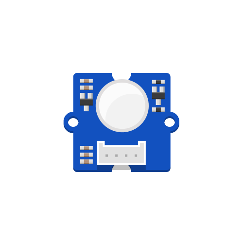     |      | 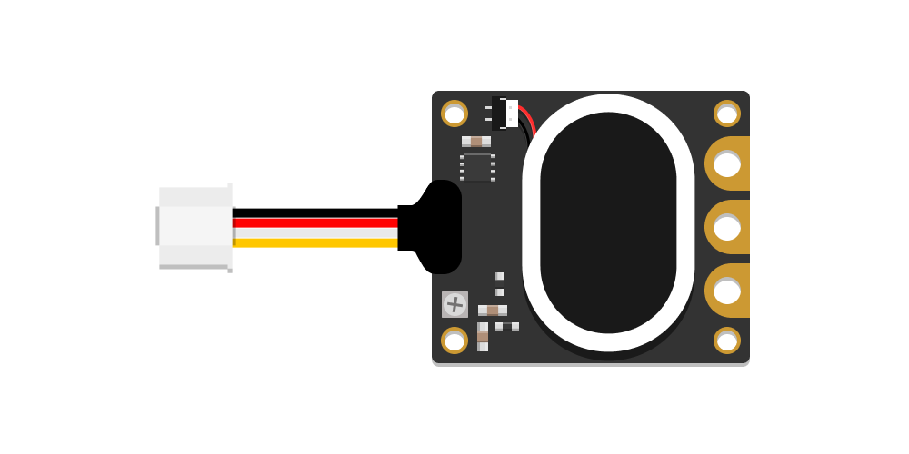 |
|   |   |   |
| [Learn More](motion-sensor/motion-sensor){: .btn .btn-blue } |      [Learn More](9dof-imu/9dof-imu){: .btn .btn-blue }      | [Learn More](audio-amp-speaker/audio-amp-speaker){: .btn .btn-blue } |

|                         Piezo Buzzer                         |                      NeoPixel RGB LED's                      |                         Servo Motor                          |
| :----------------------------------------------------------: | :----------------------------------------------------------: | :----------------------------------------------------------: |
|                            Sound                             |                          RGB Light                           |                            Motion                            |
| 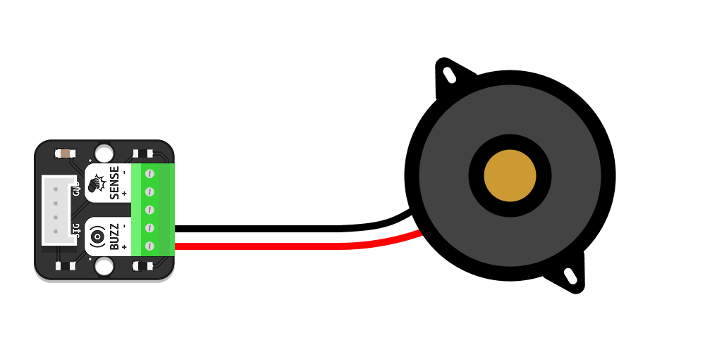 | 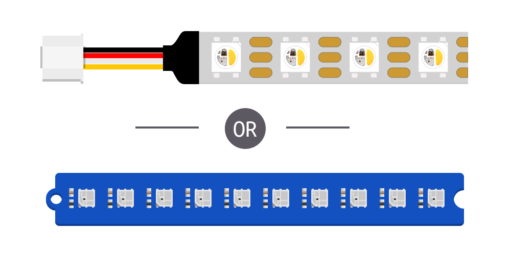  |      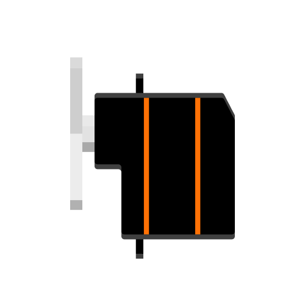      |
|   |   |   |
|  [Learn More](piezo-buzzer/piezo-buzzer){: .btn .btn-blue }  | [Learn More](led-components/led-components){: .btn .btn-blue } |   [Learn More](servo-motor/servo-motor){: .btn .btn-blue }   |

|                         OLED Screen                          |                        DC Motor & Fan                        |                    Custom Terminal Block                     |
| :----------------------------------------------------------: | :----------------------------------------------------------: | :----------------------------------------------------------: |
|                           Display                            |                            Motion                            |                           Various                            |
|      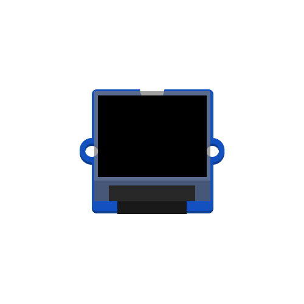      |          | 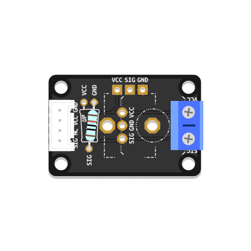 |
|   |   |   |
|   [Learn More](oled-screen/oled-screen){: .btn .btn-blue }   |      [Learn More](mini-fan/mini-fan){: .btn .btn-blue }      | [Learn More](custom-terminal/custom-terminal){: .btn .btn-blue } |
