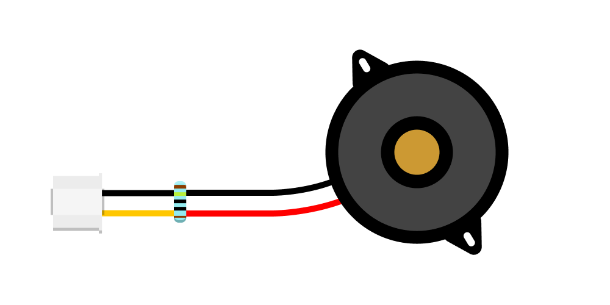

# Knock Sensor

<a href="../../glossary/glossary"></a> <a href="../../glossary/glossary"></a>

Can detect knocks and impacts.

This component is based on [Adafruit's Large Enclosed Piezo Element](https://www.adafruit.com/product/1739).

{:.important}
Make sure your component has a resistor in parallel with the Piezo Element (bridging the black wire to the red/yellow one, as shown above.) If there is a resistor embedded in the black wire, then the component is configured as a [Piezo Buzzer](../piezo-buzzer/piezo-buzzer) and cannot be used as a sensor!

---

## Background

A Piezoelectric Disc is an electronic component commonly used to generate audible signals or alarms in electronic circuits. It converts electrical signals into mechanical vibrations, which we perceive as sound. Conversely, it can also convert mechanical vibrations, knocks, or impacts into electrical signals, allowing it to function as a sensor. Its function is determined by how it is set up electronically.

This article discusses using the Piezoelectric Disc as a sensor to detect knocks and impacts.

## Basic Usage

The code example below reads the value from a piezoelectric sensor connected to pin **A1** on each run through the main loop. If the sensor detects an impact with a value greater than the defined threshold of 1000, it prints a message along with the sensor's reading to the Serial Monitor. The loop pauses briefly after each check to prevent overwhelming the output.

```python
# --- Imports
import time
import board
import analogio

# --- Variables
detect_threshold = 1000
knock_sensor = analogio.AnalogIn(board.A1)

# --- Functions

# --- Setup

# --- Main loop
while True:
    if knock_sensor.value > detect_threshold:
        print(f"Knock! ({knock_sensor.value})")
    time.sleep(0.1)

```


## Using Debounce to Filter Out Unwanted Knocks

In this code example, debouncing is used to prevent multiple detections of the same knock. Debouncing works by introducing a short delay between valid knock detections, filtering out any triggers that happen too quickly to be intentional.

To achieve this, we use `time.monotonic()` to get the number of seconds (as a floating-point number) that have elapsed since the microcontroller was powered on. On each run through the main loop, the conditions `sensor_value >= detect_threshold` and `(current_time - last_knock_time) > debounce_time` are checked to ensure the sensor value exceeds the threshold and that enough time has passed since the last knock before registering a new one.

```python
# --- Imports
import time
import board
import analogio

# --- Variables
detect_threshold = 1000
debounce_time = 0.4  # 400 ms debounce time
knock_sensor = analogio.AnalogIn(board.A1)
last_knock_time = 0

# --- Functions

# --- Setup

# --- Main loop
while True:
    current_time = time.monotonic()
    sensor_value = knock_sensor.value

    if sensor_value >= detect_threshold and (current_time - last_knock_time) > debounce_time:
        print(f"Knock! ({sensor_value})")
        last_knock_time = current_time  # Update the time of the last valid knock

    time.sleep(0.01)
```
