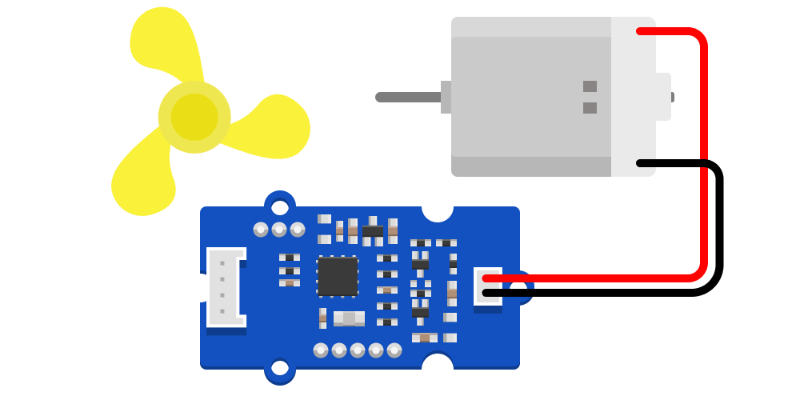

# DC Motor Fan
<a href="../../glossary/glossary"></a> <a href="../../glossary/glossary"></a>

A small DC motor with a soft plastic fan attachment. Safe to touch, even when spinning.

---

## Background

The [Grove Mini Fan](https://wiki.seeedstudio.com/Grove-Mini_Fan/) is based on a DC motor and controller board. The module translates an analog input signal on the Grove **SIG** pin into a drive signal for the motor.

In practice, a PWM signal with a fast duty cycle works well. This gives you two simple ways to use the fan:

- As a **digital on/off component**, switching the motor fully on or off.
- With a **PWM signal** to adjust how much power the motor receives.

## Basic Usage

This example uses the fan as a simple digital component. It switches the motor **on** for 3 seconds, then **off** for 3 seconds, in a repeating loop. The fan is connected to pin **GP18**.

```python
# --- Imports
import time
import board
import digitalio

# --- Variables
fan = digitalio.DigitalInOut(board.GP18)
fan.direction = digitalio.Direction.OUTPUT

# --- Functions

# --- Setup

# --- Main loop
while True:
    print("Fan ON")
    fan.value = True
    time.sleep(3)

    print("Fan OFF")
    fan.value = False
    time.sleep(3)
```

## Speed Control

This example uses a **PWM signal** on pin **GP18** to change how much power the motor receives. The fan cycles through different power levels, pausing for two seconds at each step.

```python
# --- Imports
import time
import board
import pwmio

# --- Variables
pwm = pwmio.PWMOut(board.GP18, frequency=25000, duty_cycle=0)

# --- Functions
def set_power(percent):
    percent = max(0, min(100, percent))
    pwm.duty_cycle = int((percent / 100) * 65535)

# --- Setup

# --- Main loop
while True:
    for power in [0, 25, 50, 75, 100, 75, 50, 25]:
        print(f"Motor power: {power}%")
        set_power(power)
        time.sleep(2)
```

## Additional Resources

### [PWM in CircuitPython](https://learn.adafruit.com/circuitpython-essentials/circuitpython-pwm)

Adafruit’s guide to working with PWM signals.
