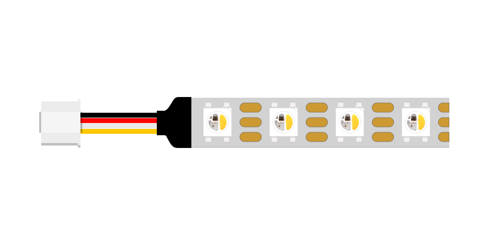

# Neopixel RGB LED Strip
<a href="../../glossary/glossary"></a> <a href="../../glossary/glossary"></a>

A light source that can produce RGB colored and white light. Can be daisy chained. 

This is a section of an [Adafruit Neopixel RGB LED strip](https://www.adafruit.com/product/2541) with a Grove connector. Extensive information on NeoPixel components and their use is available [here](https://learn.adafruit.com/adafruit-neopixel-uberguide/the-magic-of-neopixels).

---

## Preparation

To easily control these NeoPixel RGB LED's in your code, the `neopixel` [library](../../glossary/glossary) is needed. The library should be pre-loaded on your Raspberry Pi Pico.

{: .highlight }
You can verify that the library is installed by ensuring a file called `neopixel.mpy` is present in the `lib` folder of your `CIRCUITPY` drive. If not, download Adafruit's Library Bundle for Version 9.x [here](https://circuitpython.org/libraries). Extract the needed file from the bundle and place it in the `lib` folder on your microcontroller. You can learn more about libraries and their use in the [Glossary](../../glossary/glossary) or the [../../Tutorials](/Tutorials).

The examples below assume your component is connected to the connector **GP20** on the Grove Shield.

## Making LED's blink

This example uses the `fill()` [function](../../glossary/glossary) to set the brightness of each color channel `(RED, GREEN, BLUE)` to a value between 0 to 255. The value 0 corresponds to off, while 255 means fully on. A bright red LED, for example, is defined by `(255, 0, 0)` and a bright green one is `(0, 255, 0)`. `(255, 0, 255)` mixes red and blue to make the LED appear purple, while `(255, 255, 255)` will make it appear white and  `(0, 0, 0)` will turn it off. Use values between 0 and 255 to vary the brightness level and mix different colors.

During the setup phase, we use the `fill()` function and pass it the value `0` to ensure all LEDs are off on startup. In this context, `0` is identical to `(0, 0, 0)`. The `show()` function is called to display the new values defined using `fill()`.

```python
# --- Imports
import time
import board
import neopixel

# --- Variables
pin_leds = board.GP20

num_leds = 6 
leds = neopixel.NeoPixel(pin_leds, num_leds, auto_write=False, pixel_order=neopixel.GRB)

# --- Functions

# --- Setup
leds.fill(0)
leds.show()

# --- Main loop
while True:
    print("ON")
    leds.fill((255, 0, 255))
    leds.show()
    time.sleep(1)
    
    print("OFF")
    leds.fill((0, 0, 0))
    leds.show()
    time.sleep(1)
```

{: .note }
At the end of our neopixel [object](../../glossary/glossary)  [declaration](../../glossary/glossary) , we define `pixel_order=neopixel.GRB`. This does *not* mean that our code expects us to provide color information in that order; it describes the configuration of the LED itself. The code still expects color information to be arranged in the order `(RED, GREEN, BLUE)`. If you buy other NeoPixel-compatible components online, the `pixel_order` value may need to be configured differently. A comprehensive guide on how to use different kinds of NeoPixels is available [here](https://learn.adafruit.com/circuitpython-essentials/circuitpython-neopixel).

## Fading LED's in and out

This example uses a `for` [loop](../../glossary/glossary) to increase and decrease the brightness of an LED on each run through the loop. The `sleep()` function is used to slow down the speed at which the loop iterates. 

```python
# --- Imports
import time
import board
import neopixel

# --- Variables
pin_leds = board.GP20

num_leds = 6 
leds = neopixel.NeoPixel(pin_leds, num_leds, auto_write=False, pixel_order=neopixel.GRB)

delta = 5

# --- Functions

# --- Setup
leds.fill(0)
leds.show()

# --- Main loop
while True:
    print("Fading in...")
    for intensity in range(0, 255, delta):
        leds.fill((0, 0, intensity, 0))
        leds.show()
        time.sleep(0.05)

    print("Fading out...")
    for intensity in range(255, 0, -delta):
        leds.fill((0, 0, intensity, 0))
        leds.show()
        time.sleep(0.04)
```

{: .note }
Using the `sleep()` function to set the fading speed will prevent other code from executing while sleeping. This is called a blocking delay and does not work well when multitasking. You can read Adafruit's tutorial on [Multitasking with CircuitPython](https://learn.adafruit.com/multi-tasking-with-circuitpython/no-sleeping) to learn about a non-blocking alternative.

## Addressing LEDs individually

This example demonstrates how to address individual LEDs in a chain. As before, the `fill()` function is used, this time to define a common value for the entire chain. To specify a color for each LED individually, refer to the code below. Note that LEDs are indexed starting from 0, which refers to the first LED in the chain.

As in the previous examples, we define `num_leds = 6` as the strips used in the workshop have 6 LED's. If you cut or extend your strips, make sure to adjust this numer to match the number of LED's you are using.

Remember to use the `show()` function to write the newly defined color values to the LED chain.

```python
# --- Imports
import time
import board
import neopixel

# --- Variables
pin_leds = board.GP20

num_leds = 6 
leds = neopixel.NeoPixel(pin_leds, num_leds, auto_write=False, pixel_order=neopixel.GRB)

# --- Functions

# --- Setup
leds.fill(0) # turn off all LEDs
leds.show()

# --- Main loop
while True:
    
    # set color values for the LEDs individually
    leds[0] = (255, 0, 0) # red
    leds[1] = (0, 255, 0) # green
    leds[2] = (0, 0, 255) # blue
    leds[3] = (255, 255, 0) # yellow
    leds[4] = (0, 255, 255) # cyan
    leds[5] = (255, 0, 255) # magenta
    leds.show()
    time.sleep(2)
    
    # make all LEDs white
    leds.fill((255, 255, 255)) # white
    leds.show()
    
    time.sleep(2)
```

## Cut or extend

{: .highlight }
You can cut these strips into smaller sections at the marked spots or solder multiple of them together using the provided pads. Make sure you be mindful of the orientation! Follow the arrows on the strip and look for the Din (Digital In) and Do (Digital Out) labels. It is not advised to use more than 20 LED's without external power on one Pi Pico board.

## Additional Resources

###  [Adafruit's NeoPixel Überguide](https://learn.adafruit.com/adafruit-neopixel-uberguide/the-magic-of-neopixels)
Everything there is to know about different types of NeoPixels, best practices, and how to use them.

### [NeoPixels in Adafruit's CircuitPython Essentials Guide](https://learn.adafruit.com/circuitpython-essentials/circuitpython-neopixel)
A comprehensive overview of how to configure different kinds of NeoPixels, how to use them, as well as an overview of how to go beyond the basic use of the neopixel library, such as setting up rainbow and color chase effects.
