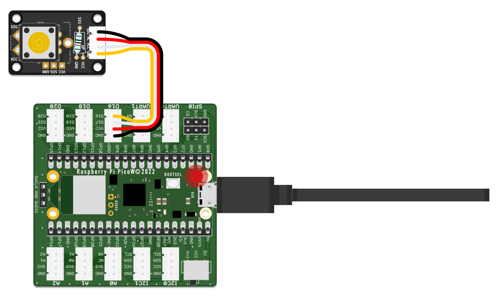

# Part 2 - Add an Output Component

Now that your prototype can register a user input, it is time to tie it together by adding your output component.




1. As with the Blink tutorial at the beginning, we will use your Pi Pico W's inbuilt LED, internally connected to the pin named **`LED`**.
2. As with the button, you need a variable to hold data to make your LED work. Make sure to give it a sensible name, such as `led`. This time, instead of reading a value from a sensor, you will use the variable to write data to an actuator. The statements needed for the LED will look very similar to the ones you wrote for the tactile switch, with one critical difference: As shown in the following example, the `digitalio.Direction` is set to `OUTPUT`.
3. As you recall, the goal is to make the LED light up for as long as the switch registers a button press. If the switch is not pressed, the LED should not be lit. CircuitPython provides a handy way to translate this idea into code using `if...else statements` ([conditional statements](../../glossary/glossary)). An `if statement` executes a block of code only if a specified condition is `True`. An `else clause` can be added to run another set of instructions should the condition be false.
4. You can use this knowledge to turn the LED on and off, depending on the current state of the switch. If `sensor.value is True:`, the LED can be turned on with `led.value = True`. Else, the LED needs to be turned off again. Remember to save your code to see it in action.
5. Try experimenting with the code to change the behavior of your prototype. Feel free to connect a different output component and see how the behavior changes, just remember to assign the used pin instead of the **`LED`** pin.

```python
import board
import digitalio
import time

sensor = digitalio.DigitalInOut(board.GP16)
sensor.direction = digitalio.Direction.INPUT

led = digitalio.DigitalInOut(board.LED)
led.direction = digitalio.Direction.OUTPUT

while True:
    print(sensor.value)
    if sensor.value is True:
        led.value = True
    else:
        led.value = False
    time.sleep(0.1)
```

{:.highlight}
It is advisable to regularly back up the code stored on the `CIRCUITPY` drive to your computer. That way, you have something to fall back on should a memory loss occur or your Pi Pico W is misplaced.

[Next Tutorial](../connecting-to-the-internet/){: .btn .btn-blue }