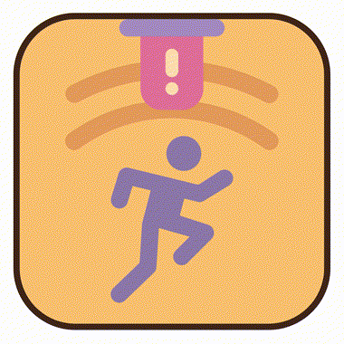
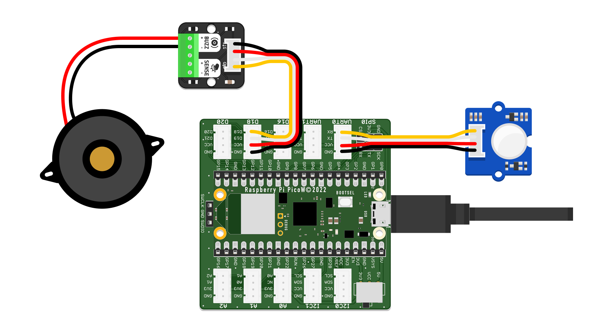

# Idea 1 – Alarm System

<div style="display: flex; align-items: center; gap: 20px;">
  <div>
    <p>
      <br>
    This project guides you through building a simple alarm system. You'll learn to use sensors to detect motion or other changes in the environment and trigger an audio alert — an intro to automated, interactive devices!
    </p>
  </div>
  
</div>


---

## What does the Alarm System do?

The basic version of this alarm system uses a motion sensor to monitor for movement. Whenever motion is detected, a loud, repetitive alarm sound is played through a buzzer. After a few moments, the system resets and continues monitoring.

You can customize your alarm system with different sensors, lights, displays, or more sophisticated logic, making it the perfect foundation for creative tinkering.

---

## How to Use

1. Power on your alarm system.
2. The system waits and monitors for motion (or another trigger, depending on your setup).
3. When a movement (or, in later versions, a tilt or rapid light change) is detected, the alarm sounds loudly.
4. After a set time, the system resets and resumes monitoring.

---

## Components for the Base System

- Microcontroller Board (Raspberry Pi Pico)
- Motion Sensor (PIR sensor)
- Buzzer (Piezo)
- Grove Cables

---

## Other Components You May Use Later

You can personalize or extend your alarm system with:
- LEDs (visual alarm, status indicators)
- Additional input sensors: 
    - Tilt/IMU sensor (for movement or angle-based triggers)
    - Light sensor (for break-in by sudden shadow/brightness)
    - Sound sensor (for noise triggers)
    - Buttons (alarm off/reset)
- OLED display (for alarm status or logs)
- More buzzers (different sound patterns)

Check the [Components](../components.md) page for available parts.

---

## Basic Setup

1. **Connect the motion sensor** to a  digital pin (GP1).
2. **Connect the buzzer** to a pwm  pin (GP18).
3. **Power and connect your board to your computer.**
4. Other modules: Plug in LEDs, displays, or additional sensors as needed.




---

## Code

Here is a simple Python example for an alarm system using a motion sensor and buzzer:

```python

# --- Imports
import digitalio
import board
import time

# --- Variables

# Set up the PIR motion sensor as INPUT (detects movement)
pir_pin = board.GP1
pir_sensor = digitalio.DigitalInOut(pir_pin)
pir_sensor.direction = digitalio.Direction.INPUT

# Set up the buzzer as OUTPUT (makes sound)
buzzer_pin = board.GP18
buzzer = digitalio.DigitalInOut(buzzer_pin)
buzzer.direction = digitalio.Direction.OUTPUT

# --- Functions
# (No functions needed for this simple version.)

# --- Setup
# (All setup is already done in the Variables section.)

# --- Main loop
while True:
    # Check if motion sensor detects movement (INPUT)
    if pir_sensor.value:
        print("Motion detected! Alarm sounding!")
        # Beep the buzzer quickly for about 5 seconds
        for i in range(50):
            buzzer.value = True     # OUTPUT: Turn buzzer ON
            time.sleep(0.05)        # Wait 0.05 seconds
            buzzer.value = False    # OUTPUT: Turn buzzer OFF
            time.sleep(0.05)
        print("Alarm reset. Monitoring resumed.")
        time.sleep(1)              # Wait before next check (prevents immediate retrigger)
    else:
        buzzer.value = False        # Make sure buzzer stays OFF
        time.sleep(0.1)             # Short delay before checking again


```

---

## Ideas for Extensions & Variations

- **Safe:** Build a Cardboard Box that you can put your alarm system into, creating a little secret safe.

- **Visual Alarms:**  
  Add an LED (or multi-color LED) that flashes when an alarm is triggered or displays system status (e.g., armed/disarmed).

- **Vibration:** Trigger a vibration sensor when the alarm goes off.

- **Disarm Mechanism:**  
  Integrate a button or secret sequence to temporarily disable or reset the alarm.

- **Display Status:**  
  Show alarm status and event log on an OLED screen—include time of last trigger.

- **Sensor Choice:**  
  Use other input devices:
    - A tilt or IMU sensor as an anti-theft/tilt alarm.
    - Use a light sensor to detect sudden changes in illumination (e.g., a door or box opened).
    - Add a sound sensor to trigger if noise is detected.


- **Smart Patterns:**  
  Vary the alarm sound pattern based on which sensor triggered the alarm (continuous for motion, beeping sequence for tilt, etc).

- **Silent Mode:**  
  Instead of a buzzer, activate a visual alert or send a message (to a display or over serial).

- **"Trap" Mode:**  
  Add a timer before activation so you can leave the room before the system arms itself.

- **Multi-Zone System:**  
  Monitor several sensors (motion, tilt, and light) and display on the OLED which "zone" was triggered.

- **Event Logging:**  
  Keep track of alarm events and display a list (time, type, how often).

---

**Start by building the basic alarm, then add features to meet your own needs or to solve new problems!**


---

### Need help?

There are several ways for you to get some help with your prototypes:

1. We have trained a custom AI-Agent for you that will help you with any questions. This is especially helpful reagarding your python-code:

    [DTI Workshop Helper](https://www.perplexity.ai/search/dti-workshop-helper-T0eH2gNyRM2elfBJcprRJw){: .btn}

2. For references on using specific components, jump to the Components section: 

    [Component Overview](../components/){: .btn}

3. Your workshop instructors are of course happy to help. Don't worry: Go ahead and ask your question.

