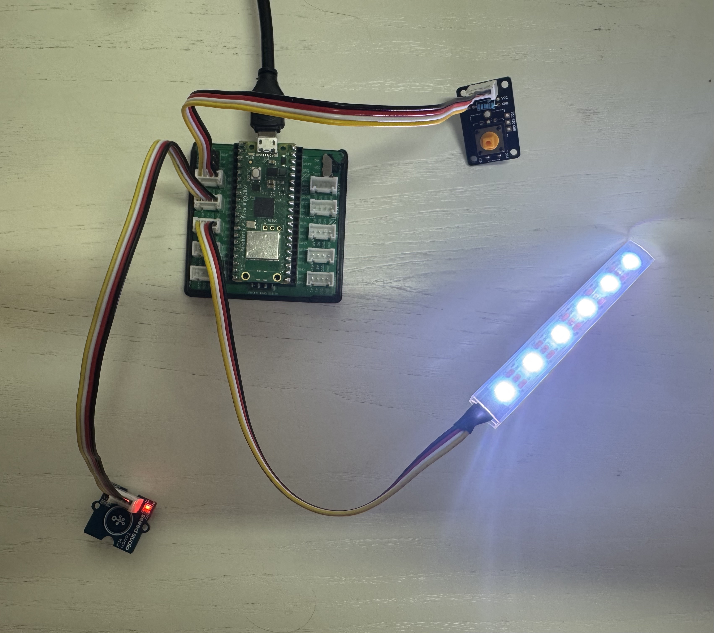

# Idea 2 - Reaction Game

<div style="display: flex; align-items: center; gap: 20px;">

  <div style="flex: 1;">
    
  </div>
    <div style="flex: 1;">
    <p>
      This is a simple but exciting two-player reaction game. It lets you practice coding basic logic, working with input and output hardware, and competing with a friend—all with minimal setup.
    </p>
    <div style="font-size: small;">
      The video shows an advanced 4 Player build of the Reaction Game by 
      <a href="https://www.youtube.com/shorts/2sUVWSIK9SU">PenguinTutor</a>
    </div>
   </div>    
</div>


## What does the Reaction Game do?

This project is a beginner-friendly two-player reaction game using tactile buttons and an RGB LED strip (NeoPixel).  
The game starts automatically when powered up. After a random short delay, the LED lights up white, and both players try to press their button as quickly as possible. The first to press wins the round—the LED flashes red or blue to show the winner. After a short pause, the game restarts.

---


## Components for the Base Game

- Microcontroller board (Raspberry Pi Pico)
- 2 × Buttons (digital input)
- 1 × RGB (NeoPixel) LED (as output)
- Connection cables

---

## Other Components You May Use Later

You can expand and personalize your game with:
- More LEDs (for visual feedback, winner indication)
- Additional buttons (to support more players)
- Display (OLED) (to show winner, reaction times, highscore, etc.)
- Buzzer or speaker (for sound effects)

Check the [Components](../components.md) page for what’s available.

---

## Basic Setup

1. **Connect the red button** to GPIO pin GP1.
2. **Connect the blue button** to GPIO pin GP5.
3. **Connect the NeoPixel LED strip** (or compatible RGB LED) to GPIO pin GP16.
4. **Plug in your microcontroller** (e.g. Raspberry Pi Pico) and connect it to your PC.
5. Optionally: add extra modules (buzzer, display, more LEDs) for your own ideas.


>**Note:** In the picture above one button and one touch sensor were used as Inputs. Both work fine, but for fairness reasons it should be the same sensor for both players.

---

## Code

Below is the complete code for a basic reaction game using two digital inputs (buttons) and an RGB LED for output. Use this as a starting point for your own logic and extensions.

```python
# --- Imports
import digitalio  # Digital input/output control
import board      # Board pin definitions
import neopixel   # Chainable RGB LED control
import time       # Time-related functions (delay, timers)
import random     # Generate random numbers for delay

# --- Variables

# Initialize buttons as digital inputs
red_button = digitalio.DigitalInOut(board.GP1)
red_button.direction = digitalio.Direction.INPUT
blue_button = digitalio.DigitalInOut(board.GP5)
blue_button.direction = digitalio.Direction.INPUT

# Initialize NeoPixel RGB LED strip on GP16 with 6 LEDs
led_pin = board.GP16
num_leds = 6
leds = neopixel.NeoPixel(led_pin, num_leds, auto_write=False, pixel_order=neopixel.GRB)

# Define RGB colors for LED indications
LED_OFF = (0, 0, 0)          # LEDs off
LED_WHITE = (255, 255, 255)  # White light to signal "Go!"
LED_RED = (255, 0, 0)        # Red light for Red player's win
LED_BLUE = (0, 0, 255)       # Blue light for Blue player's win

# Initialize timer variables
countdown_time = 0
countdown_start = 0

# Define game states
STATE_COUNTDOWN = "countdown"
STATE_WAIT_FOR_PRESS = "waiting_for_press"
STATE_WIN = "win"
current_state = STATE_COUNTDOWN

# --- Functions

def set_led_color(color):
    """Set all LEDs to the given RGB color."""
    leds.fill(color)
    leds.show()

def start_countdown():
    """Start random countdown between 3 and 7 seconds."""
    global countdown_time, countdown_start
    countdown_time = random.randint(3, 7)
    countdown_start = time.monotonic()
    print("Get ready...")

def countdown_finished():
    """Check if countdown timer has finished."""
    return time.monotonic() - countdown_start >= countdown_time

# --- Setup

# Turn off LEDs initially
set_led_color(LED_OFF)

# Start the countdown timer
start_countdown()

current_state = STATE_COUNTDOWN

# --- Main Loop

while True:
    if current_state == STATE_COUNTDOWN:
        # Wait until random delay ends
        if countdown_finished():
            set_led_color(LED_WHITE)  # Signal "Go!" with white LEDs
            print("Go! Press your button now!")
            current_state = STATE_WAIT_FOR_PRESS

    elif current_state == STATE_WAIT_FOR_PRESS:
        # Wait for either player's button press
        if red_button.value:
            print("Red wins!")
            set_led_color(LED_RED)
            win_time = time.monotonic()
            current_state = STATE_WIN
        elif blue_button.value:
            print("Blue wins!")
            set_led_color(LED_BLUE)
            win_time = time.monotonic()
            current_state = STATE_WIN

    elif current_state == STATE_WIN:
        # Keep state for 3 seconds, then restart game
        if time.monotonic() - win_time > 3:
            set_led_color(LED_OFF)
            start_countdown()
            current_state = STATE_COUNTDOWN

    time.sleep(0.01)  # Small delay to reduce CPU usage

```

> The original inspiration of this reaction game code can be found [here](https://id-studiolab.github.io/Digital-Interfaces/assignments/02-reaction-game/).


---


## Ideas for Extensions & Variations


- Show winner with extra LEDs or on a display
- Add sound effects (buzzer or speaker) when someone wins
- Replace buttons with touch sensors, light sensors, or other inputs
- Make it multiplayer by adding more buttons and LED colors
- Display winning reaction time or keep a high score
- Make color challenges or penalties for pressing at the wrong time
- Change the rules to a new game: e.g. play "Click Race"—see who clicks their button most in 10 seconds


---

**Start by getting the basic game running, then pick and implement one or more of the extensions above, or invent your own twist!**


---

### Need help?


There are several ways for you to get some help with your prototypes:

1. We have trained a custom ChatGPT-Agent for you that will help you with any questions. This is especially helpful regarding your python-code:

    [DTI Workshop Helper](https://chatgpt.com/g/g-6890968826808191b1bccc15d0e6a983-dti-workshop-helper){: .btn}

2. For references on using specific components, jump to the Components section: 

    [Component Overview](../components/){: .btn}

3. Your workshop instructors are of course happy to help. Don't worry: Go ahead and ask your question.

