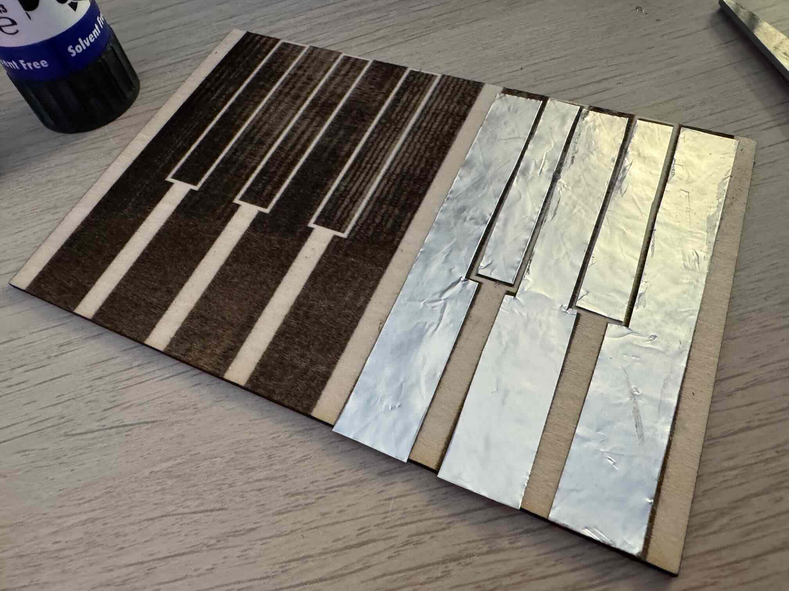

# Idea 2 – Cardboard Piano (Capacitive Touch)

Build your own simple musical instrument! With just cardboard, aluminum foil, and your microcontroller, you’ll create a working touch piano—no traditional buttons needed. This project introduces you to capacitive touch sensing and fun creative electronics.

)

---

## What does the Cardboard Piano do?

The cardboard piano uses “keys” made with aluminum foil taped to a cardboard base. When you touch a key, your finger changes the electrical properties (capacitance) of the foil, allowing the microcontroller to detect your touch. Each key is wired to a different input pin. When touched, your microcontroller plays a sound with the buzzer or even sends MIDI signals for real instrument effects!


---

## How Capacitive Touch Works

Capacitive touch sensors use the same principle as smartphone screens or touch lamps. When you connect a metallic surface (like foil), your own body adds “capacitance” to the circuit when you touch it. The Pico (or other microcontroller) can measure this—often using a resistor for each key.

- When untouched: the pin discharges “slowly.”
- When touched: the pin discharges “quickly,” due to your body’s effect.
- The software watches how fast the voltage changes to detect, “was it touched?”

For more information, see our [Touch Sensor Overview](../components/12key-touch/12key-touch.html).

---

## How to Play

1. Connect your cardboard piano to the microcontroller (using the provided template, foil, jumpers, and crocodile clips).
2. Load and run the CircuitPython code below.
3. Touch a key—hear a sound or see a note highlight!
4. Play simple tunes and try making your own.

---

## Components for the Base Piano

- Microcontroller (e.g. Raspberry Pi Pico)
- [Cardboard piano template](./assets/touch_piano.pdf) (provided at workshop)
- Aluminum foil (for the keys)
- Jumper wires / crocodile clips
- 1 M Ohm resistors (for each touch input)
- Buzzer, speaker, or use USB MIDI output (depending on extension/project scope)
- Basic connection cables

---

## Other Components You May Use

- LEDs (visual feedback per key)
- OLED display (show note names or simple visualizer)
- Extra sensors—mix with the gesture, light, or IMU sensors for creative effects

Check the [Components](../components.md) page for what’s available.

---

## Basic Setup

1. **Cover each cardboard key with foil,** so that one end can be connected to a jumper wire or crocodile clip.
2. **Connect one side of each 1M Ohm resistor** to your microcontroller input pin, and the other to the foil. Connect the other side of the foil (or a separate area) to ground.
3. **Plug in the buzzer/speaker** (or configure for MIDI over USB).
4. **Connect the Pico and get ready to play.**

*___Insert wiring/photo of setup here___*

---

## Code

Here is an example for two piano keys. Expand to more by adding pins!

```python

# Capacitive Touch Cardboard Piano – Basic Version

import board
import digitalio
import time

# Setup pins for capacitive touch sensing (Input)
key1_pin = board.GP2    # Connect to "C" key foil with 1M resistor to GND
key2_pin = board.GP3    # Connect to "D" key foil with 1M resistor to GND

key1 = digitalio.DigitalInOut(key1_pin)
key1.direction = digitalio.Direction.INPUT
key2 = digitalio.DigitalInOut(key2_pin)
key2.direction = digitalio.Direction.INPUT

# Output: buzzer or print (replace with sound playing as desired)
def play_note(note):
    print(f"Note {note} played")
    # For actual sound: activate buzzer for key1/key2, or use MIDI extension

while True:
    # Touch detection (replace with your threshold/logic, see advanced versions)
    if not key1.value:  # Touched (depends on wiring)
        play_note("C")
        time.sleep(0.2)
    if not key2.value:
        play_note("D")
        time.sleep(0.2)
    time.sleep(0.05)

```

---

## Ideas for Extensions & Variations

- **Add more keys:** Build a whole scale (C, D, E, F, G, A, B) or even sharps/flats!
- **LED feedback:** Light up an LED for each key when it’s played.
- **Octaves or sound choice:** Change octaves or instrument sounds with a button.
- **MIDI output:** Send real MIDI notes to your computer for pro sound (see advanced examples).
- **OLED display:** Show the played note or animate a “piano roll.”
- **Wild materials:** Try fruit, water, or other conductive objects as keys!
- **Improvise:** Use body contacts, wearables, or combine with gesture sensors for cool interactions.
- **Duet mode:** Allow two people to play at once, triggering chords or harmonies.

---

**Start by building the cardboard piano with a couple keys. Once it works, add sounds, graphics, or unleash your creativity with more keys and new features!**


---

 **Need help?**

There are several ways for you to get some help with your prototypes:

1. We have trained a custom ChatGPT-Agent for you that will help you with any questions. This is especially helpful regarding your python-code:

    [DTI Workshop Helper](https://chatgpt.com/g/g-6890968826808191b1bccc15d0e6a983-dti-workshop-helper){: .btn}

2. For references on using specific components, jump to the Components section: 

    [Component Overview](../components/){: .btn}

3. Your workshop instructors are of course happy to help. Don't worry: Go ahead and ask your question.

{: .highlight }