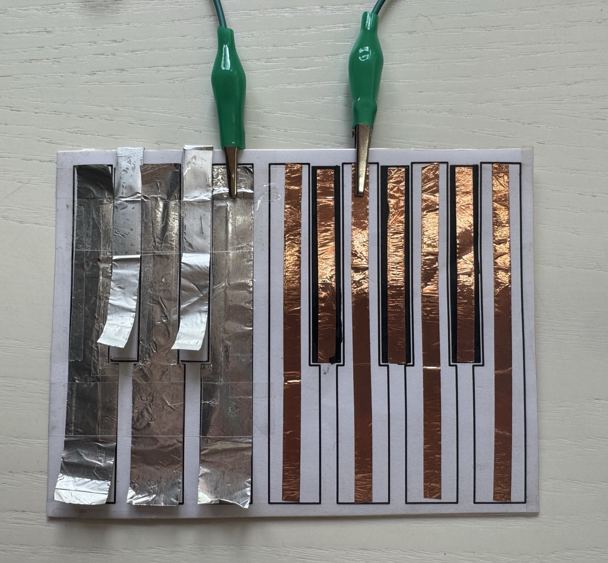
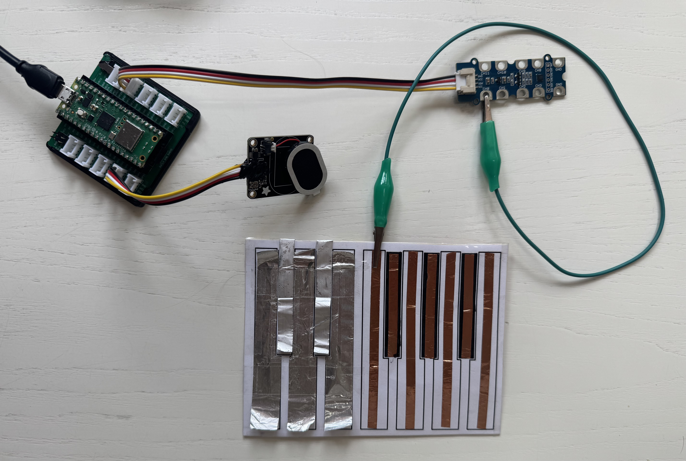

# Idea 3 – Cardboard Piano (Capacitive Touch)
<div style="display: flex; align-items: center; gap: 20px; margin-bottom: 20px;">
  <div style="flex: 1;">
    
  </div>
  <div style="flex: 1;">
    <p>
      Build your own simple musical instrument! With just cardboard, metallic foil, and your microcontroller, you’ll create a working touch piano — no traditional buttons needed. This project introduces you to capacitive touch sensing and fun creative electronics.
    </p>
    <div style="font-size: small;">
      This project is based on an <a href="https://www.kevsrobots.com/blog/chicken-nugget-piano.html">idea from Kevin McAleer</a>. As you can see in <a href="https://www.youtube.com/live/MWBl0E1Z8Ps?si=vECPxKjBB3sjbcC2&t=1765">his video</a>, with capacitive touch, you can turn anything into a sensor — even chicken nuggets!
    </div>
  </div>

</div>


---

> **Recommended:**  
Before you try this advanced piano example, please work through the [very basic capacitive touch sensor instruction](../components/12key-touch/12key-touch.html) and test them. It will give you the foundational knowledge you need to set up your Capacitive Touch sensor and understand touch detection, making it much easier to get this sound project working!

---

## What does the Cardboard Piano do?

The cardboard piano uses “keys” made of metallic foil on a cardboard base. Touching a key changes its capacitance, which is detected by the MPR121 touch sensor. Each key is connected to a separate MPR121 input. When touched, your microcontroller can play a sound (for example, a piano note from stored MP3 files using a speaker).

---

## How Capacitive Touch Works

Capacitive touch sensors detect tiny changes in electrical properties (capacitance) when you touch a conductive surface. This principle is used in smartphone screens and touch lamps! The MPR121 sensor automatically records a “baseline” value when powered on.  
> **Note:** The sensor establishes a “baseline” for capacitance on power-up. If you make changes to the connected objects or wiring after starting the system, you must restart the microcontroller (by saving your code again in the Mu-Editor) so the sensor can recalibrate for correct operation.

For more information, see our [Touch Sensor Overview](../components/12key-touch/12key-touch.html).

---

## How to Play

1. Assemble your keyboard with the provided template, metallic foil, and crocodile clips or jumper wires.
2. Make sure the included MP3 files (`C.mp3`, `D.mp3`, `E.mp3`, ...) are copied onto your Pico's root directory. (You can download them here: [C](./assets/C.mp3), [D](./assets/D.mp3), [E](./assets/E.mp3), [F](./assets/F.mp3), [G](./assets/G.mp3)).
3. Load and run the example code (after connecting all crocodile wires).
4. Touch different keys and listen to the matching piano notes from the speaker!

---

## Components for the MP3 Piano

- Microcontroller (Raspberry Pi Pico)
- Capacitive Touch Sensor: MPR121
- [Cardboard piano template](./assets/touch_piano.pdf)
- Metallic foil (aluminum or copper)
- Jumper wires / crocodile clips
- Speaker (mono, connected to audio out pin)
- MP3 files for notes
- Standard grove connection cables

---
## Basic Setup

1. **Connect each foil key** of your cardboard piano to the corresponding input pins on the MPR121 using jumper wires or crocodile clips.
2. **Connect the MPR121 capacitive touch sensor** to the Raspberry Pi Pico via the grove connector that is labeled I2C1.
3. **Connect a mono speaker** to the  output pin of the Pico (in this case e.g. GP18).
4. **Run the code below on your Pico.** Make sure you have the .mp3 files loaded onto your Pico.


> **Note:** The MPR121 establishes a capacitance baseline at startup. If you change the wiring, foil layout, or connected objects after power-on, restart the microcontroller (by saving the code.py in the Mu-Editor) so the sensor recalibrates properly.




## Code
```python
# --- Imports
import time
import board
import busio
import adafruit_mpr121
import audiomp3
import audiopwmio

# --- Declarations
# Initialize I2C for the capacitive touch sensor (adjust pins to your setup, in this case it is the Grove Connector labeled I2C1)
i2c_port = busio.I2C(scl=board.GP7, sda=board.GP6)
mpr121 = adafruit_mpr121.MPR121(i2c_port, address=0x5b) # do not change this

# --- Variables
# Setup mono audio output on GP18 using a proper amplifier/speaker
audio = audiopwmio.PWMAudioOut(board.GP18)
mp3_files = ["C.mp3", "D.mp3", "E.mp3"]  # MP3 filenames for channels 0, 1, 2, these files need to be stored as .mp3 files on your pico
current_index = None  # Needed to track which file is playing

# --- Functions
def play_mp3(index):
    """
    What does this function do? ->
    Play the MP3 file for the given index if not already playing.
    Stops any previous playback, closes old files, prevents duplicates.
    """
    global current_index, decoder

    if current_index == index and audio.playing:
        return
    if audio.playing:
        audio.stop()
    if current_index is not None:
        decoder.file.close()
    current_index = index
    print(f"Playing {mp3_files[index]}")
    decoder = audiomp3.MP3Decoder(open(mp3_files[index], "rb"))
    audio.play(decoder)

# --- Setup
# (Nothing extra needed – all config is above.)

# --- Main loop
while True:
    # Check the first three touch channels and play a note if one is touched
    if mpr121[0].value:
        play_mp3(0)   # Play C.mp3 when channel 0 is touched
    elif mpr121[1].value:
        play_mp3(1)   # Play D.mp3 when channel 1 is touched
    elif mpr121[2].value:
        play_mp3(2)   # Play E.mp3 when channel 2 is touched
    time.sleep(0.1)

```
---

## Ideas for Extensions & Variations

- **Go beyond the piano:** Attach any electrically conductive object—fruits, water glasses, coins, cutlery, bits of foil, even keys or chicken nuggets! Everything conductive becomes part of the instrument. Watch Kevin McAleer's  [Chicken Nugget Piano video](https://www.youtube.com/watch?v=lQQps31fWSA) for inspiration—see how wacky and unexpected objects make great touch sensors!
- **OLED feedback:** Show which note is played or animate a piano roll.
- **LEDs:** Light up individual LEDs for feedback on touches.
- **Duet mode:** Let two players jam together by connecting multiple inputs.

---

**Start simple, get the demo working, then build your dream instrument!**  
Upload your own MP3 files to your Raspberry Pi Pico for custom sounds and scale as you wish!

---

### Need help?


There are several ways for you to get some help with your prototypes:

1. We have trained a custom AI-Agent for you that will help you with any questions. This is especially helpful regarding your python-code:

    [DTI Workshop Helper](https://www.perplexity.ai/search/dti-workshop-helper-T0eH2gNyRM2elfBJcprRJw){: .btn}

2. For references on using specific components, jump to the Components section: 

    [Component Overview](../components/){: .btn}

3. Your workshop instructors are of course happy to help. Don't worry: Go ahead and ask your question.

