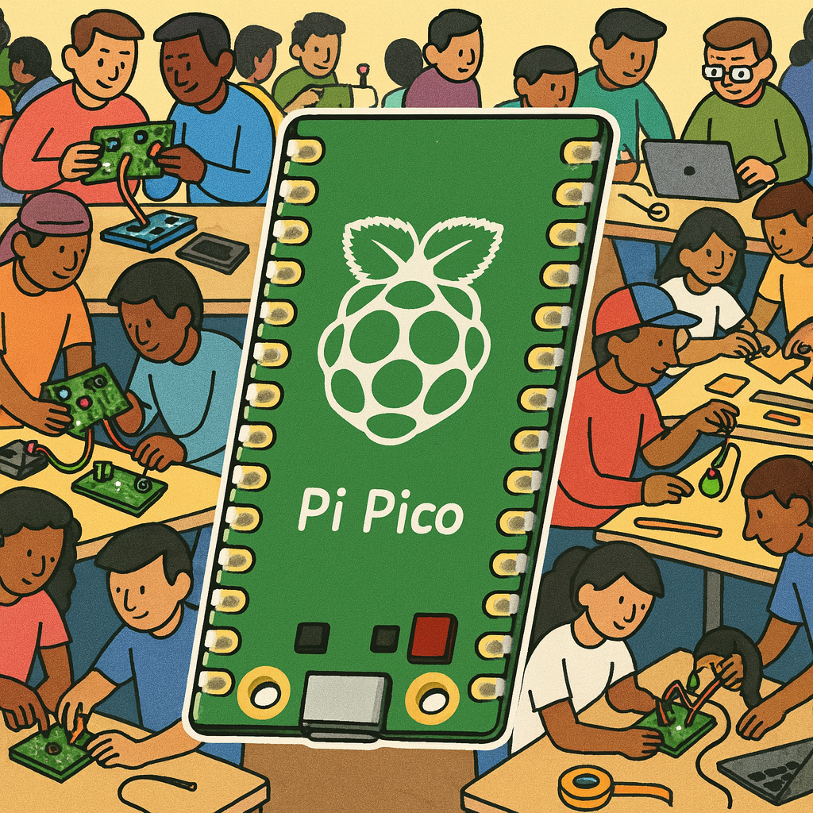

# Part 2: Get Creative! Building & Prototyping

## Welcome to Part 2 of our workshop! 

  

    

       
      Now that you have completed the tutorial section and explored the basics, it's time for hands-on prototyping and some creative experimentation.
    

  

  

---

## What’s the goal of this part?

The aim here is to give you practical experience by **building your own prototypes** with the components available. To spark your creativity, we offer a selection of project ideas you can use as starting points. Feel free to build them as described, expand and modify them, or even come up with something entirely your own. You are encouraged to experiment, combine components, and take ideas in new directions — whatever inspires you most!

## How does it work?

1. **Choose a project idea** from the list below, or start your own.
2. **Build the basic version first.** This helps you get familiar with both hardware and software aspects.
3. **Take it further:** Each project idea comes with suggestions on how to extend, modify, or personalize your prototype.
4. **Get creative:** Use or combine the ideas and suggestions, research the web or use your own imagination to start your own prototype.

## Components – What can you use?

You can use all hardware listed on the [Components](../components.md) page. Feel free to combine and experiment with any parts you like!

*If you have suggestions for other interesting components for future workshops, just let us know!*

## Project Ideas & Inspiration

Here are some for practical, ready-to-use examples you can use as a starting point: 

- [Idea 1](./idea-1.md): Alarm System
- [Idea 2](./idea-2.md): Reaction Game 
- [Idea 3](./idea-3.md): Energy Production with Water/Wind
- [Idea 4](./idea-4.md): Cardboard Piano (Capacitive Touch)
- [More Ideas](./idea-5.md) (short thought-starters)

> **Let’s create and learn together — enjoy building, prototyping, and sharing your ideas!**

---

 ### Need help?

There are several ways for you to get some help with your prototypes:

1. We have trained a custom ChatGPT-Agent for you that will help you with any questions. This is especially helpful reagarding your python-code:

    [DTI Workshop Helper](https://chatgpt.com/g/g-6890968826808191b1bccc15d0e6a983-dti-workshop-helper){: .btn}

2. For references on using specific components, jump to the Components section: 

    [Component Overview](../components/){: .btn}

3. Your workshop instructors are of course happy to help. Don't worry: Go ahead and ask your question.